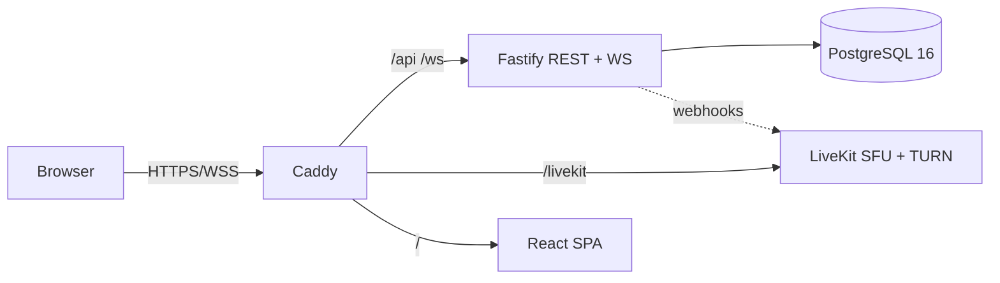

# vitality — self-hosted voice & text for friends

A Discord-like communication platform you run yourself on one small VPS:
text channels with markdown and uploads, voice channels on a self-hosted
LiveKit SFU, screen sharing, and neural noise suppression — wrapped in a
dark four-zone UI (server rail, channels, chat, members).

## Features

- Text: ULID history with cursor pagination, sanitized markdown, edit/delete,
  uploads (magic-bytes validation), typing indicators, @mentions, unread
  badges + new-message divider, read states.
- Voice: join/leave, sidebar presence for everyone, speaking ring,
  mute/deafen (server-enforced), per-user volume, devices, push-to-talk,
  reconnect, admin server-mute/disconnect, generated UI sounds.
- Screen share: presets (720p30/1080p30/1080p60/source), detail/motion
  hints, opt-in watching, theater + fullscreen, per-stream volume/quality,
  sharer cap, stop-stream moderation.
- Noise: Off / Standard (browser constraints) / Enhanced (RNNoise WASM),
  plus noise gate, mic test, loopback check; settings sync across devices.
- Ops: one-command Docker stack (Caddy HTTPS, Postgres, LiveKit+TURN),
  `make init`/`make doctor`, backups, healthchecks, structured logs.

## Quick start (3 commands)

```bash
make init     # creates .env + livekit.yaml with random secrets
make doctor   # preflight: docker, ports, secrets, DNS, disk
make up       # build + start everything over HTTPS
```

Then open `https://<your-domain>` (or `https://localhost`, accepting the
internal-CA warning) and register the first user — they become the owner.
Full walkthrough with expected outputs: `docs/FIRST_RUN.md`.

## Architecture



Monorepo (`pnpm` workspaces): `apps/server` (Fastify, Drizzle, zod),
`apps/web` (React, Vite, Tailwind, livekit-client), `apps/desktop`
(Electron wrapper), `packages/shared`
(zod protocol contract). Details: `docs/ARCHITECTURE.md`.

## Download (desktop app)

Prebuilt installers are attached to every `v*` GitHub Release
(`desktop.yml` CI builds Windows NSIS + Linux AppImage).

- **Windows:** the builds are unsigned, so SmartScreen shows
  "Unknown publisher" — click *More info → Run anyway* only for binaries
  you downloaded from our own Releases page.
- **Localhost HTTPS:** dev servers use Caddy's internal root CA
  (`https://localhost` warns until you trust it once — see
  `docs/FIRST_RUN.md`). The app **never auto-accepts certificate errors**:
  if TLS fails, the connect screen reports "unreachable" and stays put.
- Build it yourself with one command (Windows, no Docker or bash needed):

```bash
pnpm --filter @vitality/desktop dist
```

Point a dev run at your server without the connect screen:

```bash
VITALITY_SERVER_URL=https://localhost pnpm --filter @vitality/desktop dev
```

## Screenshots

_TODO: add screenshots after the first production deploy (login, channel
shell, voice call, screen share). Placeholder — do not ship stock art._

## Docs

- `docs/FIRST_RUN.md` — zero-to-running checklist (start here).
- `docs/ADMIN.md` — env reference, sizing, upgrades, backups, reverse-proxy,
  security checklist.
- `docs/VOICE.md` — LiveKit networking, bandwidth math, troubleshooting.
- `docs/TEST_STATUS.md` — what tests cover (and what only humans can).
- `docs/MANUAL_TESTS.md` — real-device test matrix.
- `docs/SECURITY_NOTES.md` — threat model, findings, accepted risks.
- `docs/ROADMAP.md` — deferred items. `AGENTS.md` — AI-agent conventions.

## Development

```bash
make dev      # postgres + livekit in Docker; server/web on the host
pnpm install
pnpm --filter @vitality/server dev   # :3000 (needs DATABASE_URL, see README)
pnpm --filter @vitality/web dev      # :5173, /api + /ws proxied
pnpm lint / pnpm typecheck / pnpm test / pnpm build
```

## License

TBD — pick before public release (MIT suggested for the code; verify
third-party licenses in `pnpm-lock.yaml` first).
