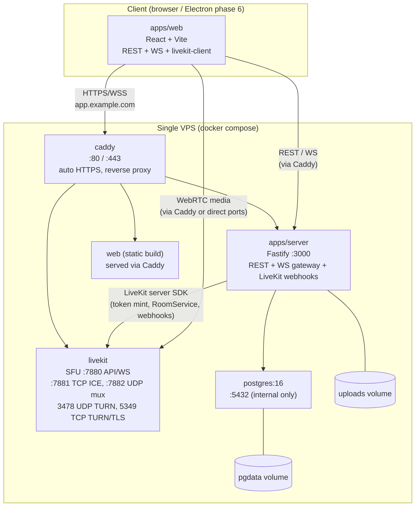
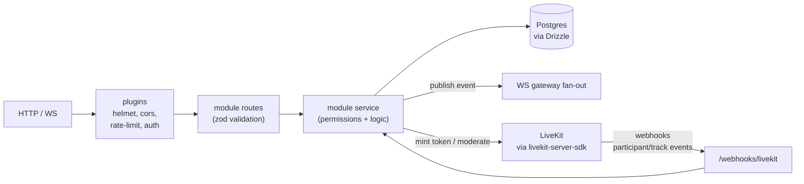
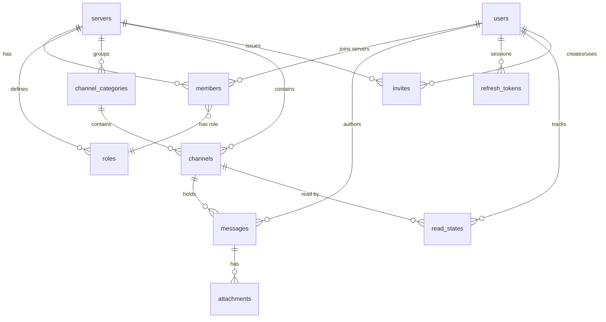

# Architecture — vitality (Phase 0, plan only)

> Status: PLAN. No application code exists yet. This document is the build contract
> for Phases 1–6. Where LiveKit or third-party behavior is described, it was
> checked against official docs in September 2026 (see References).
> App name: `vitality`. Prod domain (planned, DNS/IP pending):
> `vitality.kirskiy.shop`. Server OS: Ubuntu (single small VPS, Docker).
> Until DNS is ready, dev and smoke tests run on localhost.

## 1. Goals and constraints

### Goals

- Self-hosted, Discord-like communication platform for a friends/community
  instance: 2–50 users, up to ~15 people in one voice room, one small VPS.
- One command starts the whole server: `docker compose up`.
- Web client first (later an Electron wrapper). Features: text channels, voice
  channels, screen sharing, noise suppression, mute/deafen controls.
- Discord-like four-zone dark UI, but with an original name, icon and
  neutral-grey palette. Accent color is a CSS variable. No copied Discord
  assets, names, sounds or text.

### Non-goals for MVP

- Federation, multi-region scaling, mobile native apps.
- Custom SFU or full-mesh WebRTC. Voice/video MUST use self-hosted LiveKit SFU.
- S3 storage on day one (local Docker volume first, behind an interface).

### Fixed stack (do not substitute without asking)

- Monorepo with pnpm workspaces.
- `apps/server`: Node.js 22, TypeScript (strict), Fastify,
  `@fastify/websocket`, PostgreSQL 16, Drizzle ORM + migrations, zod,
  argon2, short-lived access JWT + rotating refresh token, pino, rate
  limiting, helmet, CORS.
- `apps/web`: React 18, Vite, TypeScript (strict), Zustand, TanStack Query,
  Tailwind CSS, Radix UI primitives, lucide-react, Inter font.
- `apps/desktop` (Phase 6): Electron wrapper around `apps/web`.
- `packages/shared`: zod schemas, WS event types, constants.
- Realtime voice/video: self-hosted LiveKit SFU. Backend mints tokens with
  `livekit-server-sdk`; web uses `livekit-client`.
- Reverse proxy: Caddy with automatic HTTPS.
- Uploads: local Docker volume for MVP behind a storage interface.

## 2. System overview



### Request paths (production)

- `https://<domain>/` → `web` static build (via Caddy `reverse_proxy` or
  `file_server` + `try_files` for SPA fallback).
- `https://<domain>/api/*` → `server` Fastify REST.
- `https://<domain>/ws` → `server` WebSocket gateway.
- `https://<domain>/livekit/*` or `wss://<domain>/livekit` → LiveKit 7880
  (TLS termination at Caddy; LiveKit itself speaks plain WS/HTTP behind it).
- WebRTC media: ICE/TCP 7881, ICE/UDP 7882 (mux) or UDP range, TURN ports —
  direct to host, NOT through Caddy HTTP proxy (see Section 9).

### Why LiveKit (not mesh, not custom SFU)

- 15 publishers in one room is infeasible with full-mesh (N² streams).
- LiveKit provides SFU routing, simulcast/dynacast, active-speaker detection,
  TURN integration, moderation APIs and maintained JS SDKs. We only write
  token minting, permission checks, webhook presence sync and UI.

## 3. Monorepo layout (target, Phase 1 scaffolds this)

```text
.
├── AGENTS.md
├── README.md
├── docs/
│   ├── ARCHITECTURE.md      # this file
│   ├── ROADMAP.md           # deferred / non-MVP items
│   └── MANUAL_TESTS.md      # real two-user voice/screenshare checklist (Phase 4+)
├── .env.example
├── Makefile                 # dev / up / logs / migrate
├── docker-compose.yml       # prod-like: caddy + server + web + postgres + livekit
├── docker-compose.dev.yml   # dev: postgres + livekit only; server/web run on host
├── Caddyfile
├── livekit.example.yaml     # LiveKit config template
├── pnpm-workspace.yaml
├── package.json             # root scripts: build/lint/typecheck/test
├── packages/
│   └── shared/              # zod schemas, WS event types, constants
│       ├── src/
│       │   ├── events.ts    # versioned WS envelope + event map
│       │   ├── schemas.ts   # REST/WS payloads (zod)
│       │   └── constants.ts # protocol version, limits, roles, permissions
│       └── package.json
├── apps/
│   ├── server/
│   │   ├── src/
│   │   │   ├── index.ts         # bootstrap (~100 lines)
│   │   │   ├── env.ts           # validated env (zod)
│   │   │   ├── db/              # drizzle client, schema/*, migrations/
│   │   │   ├── modules/
│   │   │   │   ├── auth/        # register/login/refresh/logout, argon2, JWT
│   │   │   │   ├── users/
│   │   │   │   ├── servers/     # servers, members, roles
│   │   │   │   ├── channels/    # categories + channels CRUD
│   │   │   │   ├── messages/    # CRUD, pagination, attachments
│   │   │   │   ├── invites/
│   │   │   │   ├── voice/       # LiveKit token mint, webhooks, presence
│   │   │   │   └── uploads/     # storage interface + local driver
│   │   │   ├── ws/              # gateway: auth, subscriptions, presence, fan-out
│   │   │   ├── plugins/         # helmet, cors, rate-limit, static?
│   │   │   └── lib/             # logger (pino), errors, pagination (ULID cursor)
│   │   ├── Dockerfile
│   │   └── package.json
│   ├── web/
│   │   ├── src/
│   │   │   ├── main.tsx / App.tsx / router.tsx
│   │   │   ├── api/             # REST client + TanStack Query hooks
│   │   │   ├── ws/              # socket client: backoff, resume, refetch
│   │   │   ├── store/           # Zustand slices (auth, ui, voice, presence)
│   │   │   ├── voice/           # LiveKit room manager, devices, PTT, sounds
│   │   │   ├── audio/           # noise suppression: standard vs RNNoise worklet
│   │   │   ├── components/      # shell, sidebar, chat, members, modals, settings
│   │   │   └── styles/          # tailwind, CSS vars (accent), themes
│   │   ├── Dockerfile           # static build image
│   │   └── package.json
│   └── desktop/                 # Phase 6 only: Electron wrapper
└── packages/shared/...
```

Conventions: strict TypeScript, no `any`, files under ~300 lines, small
conventional commits (`feat:`, `fix:`, `docs:`, `chore:`, `test:`).

## 4. Backend architecture (apps/server)

Fastify + plugins. Each domain module owns routes → service → db access.
No cross-module SQL; shared logic lives in `lib/`.



### 4.1 Auth

- argon2id password hashing (never log secrets).
- Access JWT: short-lived (~15 min), signed with `JWT_ACCESS_SECRET`,
  carries `sub` (user id). Sent as `Authorization: Bearer`.
- Refresh token: opaque random (≥256 bit), stored as argon2/SHA-256 hash in
  `refresh_tokens`, rotated on every use, reuse detection → revoke family.
  Transport: HttpOnly `Secure` `SameSite=Lax` cookie (local dev allows
  non-secure on localhost).
- Registration mode env: `REGISTRATION_MODE=invite-only|open` (default
  `invite-only`). First registered user becomes owner (single transaction
  guard against races; documented race-handling in Phase 2).
- Rate limits: strict on `/auth/*` (e.g. 10/min/IP) and looser on messages
  (to be tuned in Phase 3); 429 with `Retry-After`.

### 4.2 REST sketch (versioned `/api/v1`)

- `POST /auth/register|login|refresh|logout`, `GET /auth/me`.
- `GET/PATCH /users/me`, `GET /users/:id`.
- `GET /servers`, `POST /servers` (multi-server schema ready; UI uses one),
  `GET/PATCH /servers/:id`, members/roles/invites sub-resources.
- `GET/POST /servers/:id/categories`, `GET/POST /servers/:id/channels`,
  `PATCH/DELETE /channels/:id`.
- `GET /channels/:id/messages?before|after&limit` (ULID cursor),
  `POST /channels/:id/messages`, `PATCH/DELETE /messages/:id`,
  `POST /channels/:id/typing`, `POST /channels/:id/read`.
- `GET /channels/:id/voice/token` (permission-checked LiveKit mint).
- `POST /webhooks/livekit` (raw body, `application/webhook+json`, signature
  verified with `WebhookReceiver`).
- `POST /uploads` (multipart, MIME + size check), `GET /uploads/:id`.
- `GET /healthz`, `GET /readyz` (DB + LiveKit reachability).

All inputs validated with zod (shared schemas). Errors: stable JSON
`{ error: { code, message } }`, 4xx for client, 5xx logged with pino
request ids.

### 4.3 Permissions

Roles: `owner` / `admin` / `member`. Permission flags per role row:
`manage_channels`, `manage_members`, `send_messages`, `connect`, `speak`,
`share_screen`. Owner bypasses all checks. Channel-level overrides are
NOT in MVP (goes to ROADMAP). Server-mute/disconnect require
`manage_members` or `admin`.

## 5. Data model (PostgreSQL 16 + Drizzle)

ULIDs for `messages.id` (time-ordered, cursor pagination). UUIDv7 or UUIDv4
for other ids — decision locked in Phase 1 (recommend uuidv7 via
`uuidv7()` in app code to keep ordering; record here).



Tables (minimum, per spec):

- `users(id PK, username unique citext-ish, display_name, avatar_url,
  password_hash, created_at)`.
- `refresh_tokens(id, user_id FK, token_hash unique, expires_at, revoked_at,
  family_id, created_at)`.
- `servers(id, name, owner_id FK, created_at)`.
- `roles(id, server_id FK, name: owner|admin|member|custom?, permissions
  bitmask or JSON flags, position)`.
- `members(id, server_id FK, user_id FK, role_id FK, joined_at,
  UNIQUE(server_id, user_id))`.
- `channel_categories(id, server_id FK, name, position)`.
- `channels(id, server_id FK, category_id FK nullable, name, type:
  text|voice, position, created_at)`.
- `messages(id ULID PK, channel_id FK, author_id FK, content text,
  created_at, edited_at nullable, deleted_at nullable)`.
- `attachments(id, message_id FK, uploader_id FK, filename, mime, bytes,
  storage_key, width/height nullable, created_at)`.
- `invites(id, server_id FK, code unique, created_by FK, max_uses nullable,
  uses, expires_at nullable, created_at)`.
- `read_states(user_id FK, channel_id FK, last_read_message_id ULID,
  updated_at, PK(user_id, channel_id))`.
- Voice presence is NOT a table in MVP: authoritative state = LiveKit room
  state reconciled via webhooks + `GET /channels/:id/voice/token` joins, held
  in memory and re-broadcast as `voice.state`. Optional `voice_sessions`
  audit table deferred to ROADMAP.

Indexes: `(channel_id, id)` on messages for cursor paging; trigram/full-text
index deferred; `members(server_id, user_id)` unique; `channels(server_id,
position)`.

Seed (migration + idempotent seed script): category `Text` with `#general`
(text), category `Voice` with `General` (voice). First user → owner +
member.

Migrations run on server start (Drizzle `migrate()`), before listening.
`GET /readyz` fails until migrations + DB reachable.

## 6. Realtime protocol (packages/shared, versioned)

Single WS endpoint (e.g. `/ws`) with ticket auth: the client mints a
single-use ticket via authenticated `POST /api/v1/ws-ticket` (~30s TTL,
bound to the user and their refresh-token family, hashed at rest, consumed
atomically), then connects `/ws?ticket=…`. Long-lived JWTs never appear in
URLs (and therefore never in access logs); the ticket query param is
additionally scrubbed from Caddy access logs and redacted in pino logs.
Access JWTs carry `sub` + `sid` (session family) so tickets die with logout.
Protocol version constant, e.g. `WS_PROTOCOL_VERSION = 1`.
Envelope:

```ts
// packages/shared/src/events.ts (planned, Phase 1)
type WsEnvelope<T extends WsEventName = WsEventName> = {
  v: 1;
  seq: number;          // per-connection server sequence for resume gap detect
  type: T;
  data: WsEventMap[T];
  at: string;           // ISO timestamp
};
```

Client→server: `client.hello` (resume `lastSeq`), `typing.start`,
`presence.update` (idle), `voice.join/leave/mute/deafen` intents are
REST-driven; WS is the broadcast channel (voice media state itself lives in
LiveKit).

Server→client (minimum, implemented Phase 2 unless noted):

- `server.ready` (`user_id`, per-connection `seq` start; Phase 2 addition).
- `message.create|update|delete` (+ `channel_id`). // Phase 3
- `typing.start` (`channel_id`, `user_id`, short TTL client-side;
  server-throttled to 1 per 3s per socket+channel).
- `presence.update` (`user_id`, `status: online|idle|offline`).
- `channel.create|update|delete`, `category.create|update|delete` (category
  events implied by "channel CRUD" + collapsible categories).
- `member.join|leave`, `member.role_update`.
- `voice.state` (`channel_id`, participants: `user_id`, `muted`, `deafened`,
  `sharing_screen`, `server_muted`).

Rules:

- Voice participant lists visible to everyone in sidebar even when not
  joined: server broadcasts `voice.state` to all server subscribers, sourced
  from LiveKit webhooks (authoritative) + REST join intents.
- Reconnect: exponential backoff + jitter, `lastSeq` resume; on gap or
  reconnect, client refetches `GET /servers/:id/state` snapshot (channels,
  members, presence, voice states, read states) then resumes live events.
  Inbound WS frames are capped at 64 KiB (`maxPayload`, close 1009).
- Heartbeats (ping/pong) + idle detection (client reports idle; server marks
  offline after timeout).
- All payloads zod-validated; unknown `type` ignored with metric, never crash.

## 7. Voice architecture (LiveKit SFU)

### 7.1 Room mapping

One LiveKit room per voice channel: `roomName = channelId`
(exact prefix locked in Phase 4). Never expose internal ids beyond what the
client needs; identity = `user.id`, display name via token `name` claim.

### 7.2 Token endpoint (verified SDK pattern)

Backend uses `livekit-server-sdk` v2 `AccessToken`:

- `new AccessToken(apiKey, apiSecret, { identity: userId })`.
- `addGrant({ roomJoin: true, room: roomName })` with `canSubscribe: true`,
  `canPublishData: false`, and `canPublishSources: [MICROPHONE]` when the
  role has `speak` (listen-only otherwise: `canPublish: false`). The
  explicit sources list (not `canPublish`) is the Phase 5 extension point
  for `screen_share` / `screen_share_audio`.
- `await toJwt()` (async in v2). TTL 600s; client re-mints per join.

Checks before mint: authenticated, member of server, `connect` permission,
target channel is voice, room below `VOICE_MAX_PARTICIPANTS` (default 15),
per-user rate limit. One session per user: minting for channel B evicts the
user from channel A (store + broadcast + best-effort `removeParticipant`).

### 7.3 Webhooks (authoritative presence)

LiveKit POSTs `Content-Type: application/webhook+json` to
`POST /webhooks/livekit`. Server keeps the RAW body (Fastify raw-body plugin
for that route only) and verifies with
`new WebhookReceiver(apiKey, apiSecret).receive(rawBody, authHeader)`.
Subscribed events (minimum): `participant_joined`, `participant_left`,
`track_published`, `track_unpublished` (+ `room_finished` for cleanup).
Track events drive the `sharingScreen` flag for screen-share sources only.
On each webhook: update in-memory voice registry → broadcast `voice.state`
over WS. Webhook secret and API key/secret come from env only.

State ownership (Phase 4 final): the in-memory voice store mirrors LiveKit
room membership (webhooks + startup/periodic reconcile). It fills the
`voice` section of the state snapshot; `server.ready` stays a handshake
(the client refetches the snapshot on connect). Mic/deafen flags arrive via
the validated `voice.state.update` WS intent (participants only, 1s
throttle); server-mute is enforced server-side (client unmute held while
`serverMuted`). Moderation uses `RoomServiceClient` (`mutePublishedTrack`,
`removeParticipant`); kick/leave/channel-delete/role-change evict voice
first (best effort — reconcile is membership-gated so ghosts cannot return).

Client LiveKit events (active speaker, mute) are UX hints; the sidebar list
is driven by server `voice.state`, not by client gossip.

### 7.4 Client voice flows (apps/web `voice/`)

- Click voice channel → `GET token` → `livekit-client Room.connect(url,
  token)` → publish mic (constraints per noise mode) → WS `voice.state`
  shows participant everywhere.
- Mute: `setMicrophoneEnabled(false)` / unpublish; icon broadcast via
  `voice.state`. Deafen: locally mute all subscriptions + imply mic mute;
  un-deafen restores previous mic state. States broadcast to others.
- Speaking indicator: LiveKit active-speaker callback → CSS ring; server does
  not relay per-frame levels.
- Per-user volume slider: `participant.setVolume()` (local only).
- Devices: `enumerateDevices`, input/output select, `setSinkId` where
  supported; mic test level meter via AnalyserNode.
- Push-to-talk (web): keybind (while tab focused) toggles mic publish
  momentarily. Global PTT needs Electron (Phase 6).
- Join/leave/mute sounds: original/generated tones only (no Discord assets).
- Reconnect: LiveKit auto-reconnect + our WS resume; clear errors for
  permission-denied / no-device / network.
- Moderation: admin `server-mute` (LiveKit `mutePublishedTrack` via
  `RoomServiceClient`/`LiveKitAPI.room`) and disconnect
  (`removeParticipant`); server records `server_muted` so rejoin stays muted.

Bandwidth: Opus DTX, dynacast/adaptive stream on; screen share subscribed
on demand ("Watch stream" opt-in).

## 8. Screen sharing

- "Share Screen" button in the voice panel (visible only when connected and
  the role has `share_screen`). Web uses `getDisplayMedia` via
  `setScreenShareEnabled`; Electron (Phase 6) gets a custom source picker.
- Presets: 720p30, 1080p30, 1080p60 (custom `VideoPreset`), Source (native);
  `contentHint` "detail" vs "motion" toggle; `simulcast: true`,
  `degradationPreference: "maintain-resolution"`. System/tab audio capture
  attempted where the browser/OS supports it (`systemAudio: "include"`),
  with graceful fallback and UI limits notes.
- Viewers never auto-subscribe to screen tracks (unsubscribed on
  `TrackSubscribed` unless watching): tile with "Watch stream" opt-in,
  theater + fullscreen, per-stream volume, quality selector
  (Auto/Low/Medium/High via `setVideoQuality`), degraded hint from live
  connection quality. Multiple simultaneous sharers (cap
  `VOICE_MAX_SHARERS=3`, excess frozen server-side). Deafen silences
  screen audio too.
- Simulcast + dynacast/adaptive stream enabled for screen tracks; bandwidth
  math and defaults in `docs/VOICE.md`.
- Live badge next to the sharer's name in the sidebar (from
  `voice.state` sharing flags, webhook-driven).

## 9. Noise suppression + Voice & Audio settings

Four modes (user setting, persisted to localStorage + server profile via
`GET/PUT /api/v1/users/me/voice-settings`, which wins at boot):

1. Off — raw mic.
2. Standard — `getUserMedia` constraints (`noiseSuppression`,
   `echoCancellation`, `autoGainControl`) with individual toggles.
3. Enhanced — RNNoise (WASM, AudioWorklet) in the mic chain
   (`getUserMedia → suppressor → gate? → gain → analyser → destination`,
   published as a processed track).
4. Deep — DeepFilterNet3 (WASM, AudioWorklet) in the same chain slot;
   strongest suppression on speech-shaped noise, heaviest cost.

Modes 3 and 4 are "neural": both force a 48 kHz mono context, so browser
`noiseSuppression` is forced off (double processing) and the mono output is
up-mixed to stereo through a `ChannelMergerNode` (centred playback).

Implemented with `@sapphi-red/web-noise-suppressor` 0.4.1 (MIT, verified
against the installed types + Vite `?url` worklet/wasm imports; RNNoise
core BSD-3-Clause) and `@lofcz/deepfilternet-web` 0.1.0 (DeepFilterNet3
WASM model, fetched lazily only when the mode is picked). Only the Deep
package's two ASSETS are used (worklet + `df_bg.wasm` via `?url`) and the
worklet is instantiated as a plain `AudioWorkletNode`, so our own
gate/gain/analyser/loopback chain stays in control — the package's
end-to-end stream helper would create its own AudioContext and bypass it.
Requires a 48 kHz AudioContext (checked at runtime, fallback with notice),
AudioWorklet + WASM. Fallback ladder: Deep → Enhanced → Standard, so a
missing capability degrades instead of killing the mic. Build gotcha
(verified): Vite inlines `?url` assets under 4 KiB as `data:` URLs, which
AudioWorklet rejects — so `assetsInlineLimit: 0` forces real files (CI
asserts both worklets + all wasms in dist). Note the Deep model is ~34 MB
(≈12.8 MB gzip) and is downloaded once, on demand, per browser. Mode/device
changes rebuild the chain live without leaving the room (mute preserved).

Also: library `NoiseGateWorkletNode`-independent local gate? No — the
library's own `NoiseGateWorkletNode` is used (threshold slider, works in
every mode), input volume via chain gain, mic-test meter via analyser tap,
"Hear myself" loopback (headphone warning). CSP needs `wasm-unsafe-eval`
(helmet merge + Caddy header for the SPA, pinned by unit test + CI smoke
header check + CI dist asset check).

## 10. Frontend architecture (apps/web)

- React 18 + Vite + TS strict. Routing: minimal (e.g. `/login`, `/`,
  `/channels/:id`); most state is the app shell, not URLs.
- Server state: TanStack Query over REST (channels, messages with infinite
  scroll, members). Client/ephemeral state: Zustand (auth session, UI
  drawers/modals, voice connection, presence map, settings draft).
- Four-zone layout: server rail 72px | channel sidebar 240px | main chat |
  member list 240px; user panel pinned bottom-left (avatar, name, mute,
  deafen, settings; when connected: quality, channel, disconnect).
  Below ~768px, sidebar + members become slide-in drawers.
- Styling: Tailwind + CSS variables (`--accent`, surfaces approx `#1e1f22` /
  `#2b2d31` / `#313338` — similar dark neutrals, not copied assets).
  Radix primitives for dialogs/menus/tooltips; lucide-react icons; Inter.
- Chat: cursor pagination upward infinite scroll; auto-scroll only when
  already at bottom; sanitized markdown (bold/italic/strike/code/quotes/links,
  no XSS — library TBD Phase 3, e.g. marked/dompurify or react-markdown with
  sanitizer, verified then); edit/delete own (+admin delete any); uploads
  with size/MIME checks + inline image previews; typing indicator; unread
  badges + "new messages" divider; @mentions.
- Accessibility: keyboard navigable, visible focus, aria-labels on all icon
  buttons, modals trap focus (Radix default).
- Secure context: mic/screen require HTTPS in prod (Caddy) — localhost exempt
  for dev.

## 11. Docker topology and config

### Services (docker-compose.yml)

| Service  | Image / build            | Ports (host)                        | Purpose                    | Healthcheck               |
|----------|--------------------------|-------------------------------------|----------------------------|---------------------------|
| caddy    | caddy:2-alpine           | 80/tcp, 443/tcp (+443/udp optional) | Auto HTTPS, reverse proxy  | `caddy version` / `:2019` |
| server   | build apps/server        | internal :3000                      | REST + WS + webhooks       | `GET /healthz`            |
| web      | build apps/web → static  | served via Caddy                    | SPA bundle                 | static file check         |
| postgres | postgres:16-alpine       | none public (internal :5432)        | Primary datastore          | `pg_isready`              |
| livekit  | livekit/livekit-server   | 7880 internal; 7881/tcp, 7882/udp, 3478/udp, 5349/tcp public | SFU + embedded TURN | WS/API check       |

Named volumes: `pgdata`, `uploads`. `restart: unless-stopped` (prod).
`docker-compose.dev.yml`: only `postgres` + `livekit` for host-run dev.

### LiveKit config template (livekit.example.yaml, outline)

```yaml
port: 7880
bind_addresses: ["0.0.0.0"]
rtc:
  tcp_port: 7881
  udp_port: 7882        # UDP mux: single-port media (small VPS friendly)
  # port_range_start: 50000
  # port_range_end: 60000  # alternative to udp_port; pick ONE strategy
  use_external_ip: true # REQUIRED in prod behind NAT/Docker
turn:
  enabled: true
  udp_port: 3478
  tls_port: 5349
  # domain / cert_file / key_file when terminating TURN/TLS at LiveKit
keys:
  <api-key>: <api-secret>   # injected via env, never committed
room:
  auto_create: true
webhooks:
  urls: ["http://server:3000/webhooks/livekit"]
  api_key: <api-key>
```

Final key names verified against the LiveKit version pinned in Phase 4
(`config-sample.yaml` in the pinned image wins over this sketch).

### Firewall (host / cloud security group)

| Port(s)         | Proto   | Exposed to | Purpose                                  |
|-----------------|---------|------------|------------------------------------------|
| 80              | TCP     | world      | ACME HTTP-01 + redirect to HTTPS         |
| 443             | TCP     | world      | HTTPS (app, API, WS, LiveKit signalling) |
| 7881            | TCP     | world      | WebRTC ICE over TCP (fallback)           |
| 7882            | UDP     | world      | WebRTC media (UDP mux mode)              |
| 3478            | UDP     | world      | TURN/UDP (+STUN)                         |
| 5349            | TCP     | world      | TURN/TLS                                 |
| 50000–60000     | UDP     | world      | ONLY if using port-range mode instead of UDP mux |
| 5432, 3000, 7880| —      | none (docker net only) | Never expose publicly          |

On Linux prefer `network_mode: host` for the `livekit` service for media
performance; otherwise ensure `use_external_ip: true` + correct NAT mapping.
Document the chosen mode in README at Phase 1.

## 12. WebRTC troubleshooting (README preview, expanded Phase 4)

- Symptom: connects on LAN/localhost, fails on VPS → check `use_external_ip`,
  firewall UDP 7882/3478, Caddy TLS validity (secure context required).
- Symptom: audio connects but drops on corporate VPN → falls back to ICE/TCP
  7881; ensure 7881 open; TURN/TLS 5349 as last resort.
- Symptom: `getUserMedia` throws `NotAllowedError`/`NotFoundError` →
  permission denied vs no device; UI must distinguish and guide.
- Symptom: screen share has no audio → browser/OS limitation; show fallback
  notice (custom picker + system audio only in Electron where OS allows).
- Debug: `chrome://webrtc-internals`, LiveKit server logs (`log_level`),
  `docker compose logs livekit`, TURN connectivity test.

## 13. Uploads

`UploadStorage` interface (`put/get/delete`, size/MIME validation hooks).
MVP driver: local filesystem on the `uploads` Docker volume. S3/MinIO driver
slot reserved (config key `STORAGE_DRIVER=local|s3`, S3 deferred to
ROADMAP). Serve via server (`GET /uploads/:id` with auth + content-type
allowlist) or Caddy `handle_path` — decision in Phase 3.

## 14. Security baseline

- argon2id, env-only secrets, `.env.example` with no real values, never
  commit secrets, no secrets in pino logs (redaction).
- zod everywhere (REST + WS + webhooks with raw-body verify).
- helmet, CORS allowlist, rate limits (auth + messages + token endpoint).
- Upload MIME sniffing + size caps + extension allowlist; sanitized markdown
  render; `Content-Security-Policy` via Caddy/helmet; secure cookie flags.
- LiveKit API secret never leaves server; client only gets short-lived JWTs.

## 15. Ops

- Migrations run on server start; `make migrate` for manual runs.
- `GET /healthz` (liveness) and `GET /readyz` (DB + migrations + LiveKit
  reachability).
- Structured pino logs with request ids; `make logs`.
- Backup/restore (Phase 6 docs): `pg_dump` + `uploads` volume snapshot;
  upgrade notes per release.
- Makefile targets: `dev` (compose.dev + host server/web), `up` (full
  compose), `logs`, `migrate`, plus `lint/typecheck/test` passthroughs.

## 16. Testing strategy

- Server unit tests (vitest): auth, permissions, pagination, token-grant
  mapping, webhook handler (mocked LiveKit).
- Integration tests against real Postgres (testcontainers or compose
  service): register→login→channels→messages, invite-only enforcement,
  first-user-owner.
- Playwright e2e (Phase 6 gate): register→login→create channel→send message;
  voice UI states with Chromium fake-media flags
  (`--use-fake-device-for-media-stream --use-fake-ui-for-media-stream`).
- Manual checklist `docs/MANUAL_TESTS.md` (Phase 4+): real two-user voice,
  screen share presets, noise modes, PTT, TURN-behind-NAT.

## 17. Phase plan and acceptance gates

- Phase 1 (skeleton/infra): monorepo, shared pkg, compose + healthchecks,
  migrations, CI (lint/typecheck/test), Caddy HTTPS. Gate: `docker compose
  up` → empty app over HTTPS/localhost.
- Phase 2 (auth/structure): auth, invites, roles, CRUD, WS gateway +
  presence, shell UI with real data.
- Phase 3 (text chat): history pagination, markdown, edit/delete, uploads,
  typing, unread/mentions.
- Phase 4 (voice): token endpoint + webhooks + sidebar participants +
  mute/deafen + devices + speaking + web PTT + reconnect + moderation.
- Phase 5 (screen + noise): presets, watch opt-in, simulcast/dynacast,
  3-mode suppression + Voice & Audio page.
- Phase 6 (polish): Electron (global PTT, picker, system audio), a11y pass,
  e2e suite, final docs + ROADMAP.

Each phase ends with: build + lint + tests + `docker compose up` smoke test,
report, STOP.

## 18. Risks and mitigations

| Risk | Impact | Mitigation |
|------|--------|------------|
| UDP blocked / NAT on small VPS | Voice fails remotely though local works | UDP mux 7882 + TURN 3478/5349, `use_external_ip`, host networking on Linux, troubleshooting docs |
| `@sapphi-red/web-noise-suppressor` stale (last release ~2y ago) | Enhanced mode bit-rots with Vite/AudioWorklet | Pin version, verify in Phase 5 against current Vite; fallback Standard+gate; isolate behind `NoiseSuppressor` interface so we can swap |
| Electron scope creep | Delays MVP voice | Electron ONLY Phase 6; web PTT tab-focused is MVP |
| Single VPS CPU for 15 Opus + screenshares | Jitter/loss | Dynacast, watch-on-demand, simulcast, Opus DTX; load note in README; no transcode in MVP |
| First-user-owner race | Two owners | Unique partial index / transaction guard + test |
| Webhook spoofing / replay | Fake presence | `WebhookReceiver` verify + timestamp tolerance, internal-only URL option, idempotent handlers |
| XSS via markdown/uploads | Account takeover | Sanitized render, MIME allowlist, CSP, no inline scripts |
| Secret leak via compose/env | Full compromise | `.env.example` only, env validation fails fast, no secrets in logs/images |

## 19. Confirmed decisions

1. App name: `vitality`. Single VPS on Ubuntu, single domain
   `vitality.kirskiy.shop` (DNS/IP pending — until then, localhost dev/smoke).
   Caddy manages certificates (no external LB).
2. MVP UI uses ONE server (schema supports several).
3. Registration `invite-only` by default; open mode via env.
4. LiveKit media: UDP mux (7882) confirmed (not the 50k–60k range).
5. `apps/desktop` starts only in Phase 6.
6. Monorepo goes into a new clean directory (current workdir is polluted).

## 20. References (checked September 2026)

- LiveKit ports/firewall: `docs.livekit.io/transport/self-hosting/ports-firewall`
  — 7880 API/WS, 7881 ICE/TCP (`rtc.tcp_port`), 7882 ICE/UDP mux
  (`rtc.udp_port`), 50000–60000 ICE/UDP range, 3478 TURN/UDP, 5349 TURN/TLS.
- LiveKit deployment: `docs.livekit.io/.../deployment` — `use_external_ip:
  true`, host networking for Docker, TURN/TLS 443-when-no-LB note.
- `livekit-server-sdk` (JS v2) README + reference: `AccessToken` with
  `{ identity }`, `addGrant({ roomJoin, room, canPublish, canSubscribe })`,
  async `toJwt()` (default TTL 6h, override down); `WebhookReceiver(apiKey,
  secret).receive(rawBody, authHeader)`; `Content-Type:
  application/webhook+json` requires raw body handling.
- `@sapphi-red/web-noise-suppressor` (MIT): `RnnoiseWorkletNode` et al.,
  AudioWorklet, Vite `?url` worklet+wasm pattern; RNNoise core BSD-3-Clause.

---

*End of Phase 0 architecture. No code has been written. Next: Phase 1
skeleton + infra after the user answers the clarifying questions and says
"continue".*
